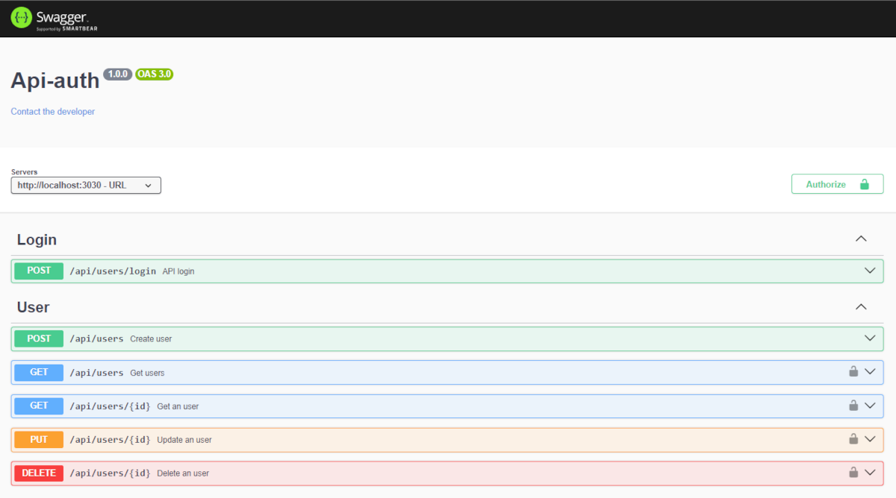

# API Auth

This project is a simple REST API, in which you can create, search, change and delete users. It is also possible to log in.

When logging in, a JWT Token is returned and must be sent in the header, as authorization, of all other endpoints, except the user creation endpoint.

## Swagger


## Executing the Project
### Docker
You need to have docker installed.

Create the docker image:
```
docker build -t api-auth .
```

Creating and running the container:
```
docker run --name api -p 3030:3030 -d api-auth
```

Go to http://localhost:3030/api/docs to view the endpoints.

## Technologies

- NodeJs
- Express
- JWT
- MongoDB
- Docker
- Swagger

## Structure

I chose to use the layered architecture, where I separated the business rules in the Services layer and the Controller was only responsible for receiving requests and returning the data already processed.

I also used the OOP and Functional Programming paradigms:
- OOP: I used it in Middleware, where I created a class that only validates values.
- FP: I used most of it in Controllers and Services, in which I kept the values immutable as much as possible, facilitating data processing and comparison.
